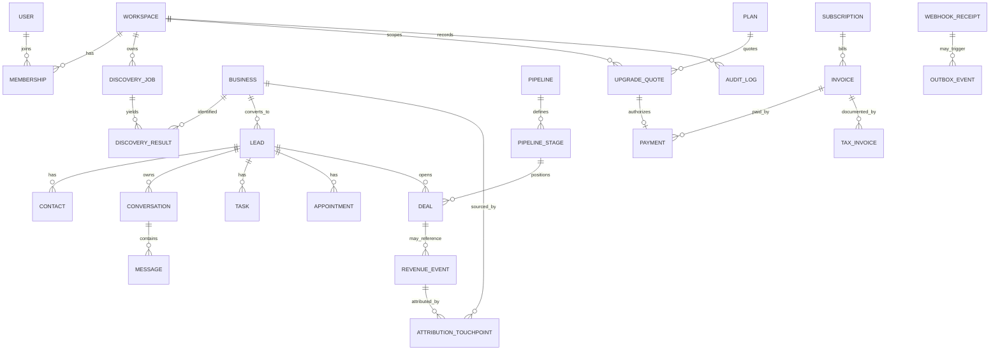

# WazLink Backend Architecture & Documentation

> **B0 status:** Architecture and contracts only. Backend coding is not authorized. This document is normative for future backend implementation agents.

**Frontend reference:** `30bc15e9ca3c0205df2b49e792fce1b8e78a36b1`  
**Scope:** Django + PostgreSQL backend design; no production implementation, migrations, endpoints, provider calls, secrets, infrastructure, or frontend changes are included in B0.

## Logical ERD

The diagram is conceptual; no migration or executable schema is authorized in B0. RevenueEvent, AttributionTouchpoint, Deal, Invoice, Payment, and TaxInvoice remain separate entities with explicit relationships and permissions. UPGRADE_QUOTE is workspace-scoped Platform Billing state that authorizes at most one Payment lineage; it has no relationship to REVENUE_EVENT and never participates in customer CRM revenue.
