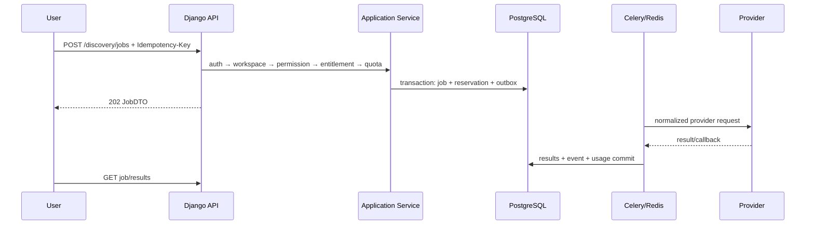
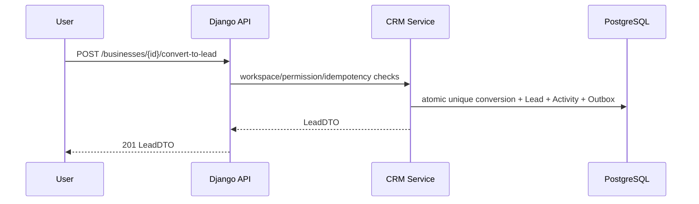
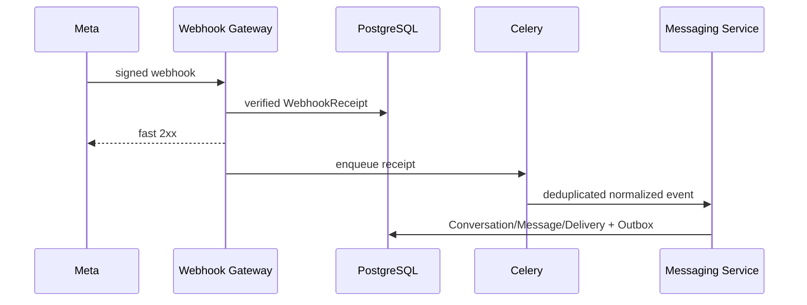
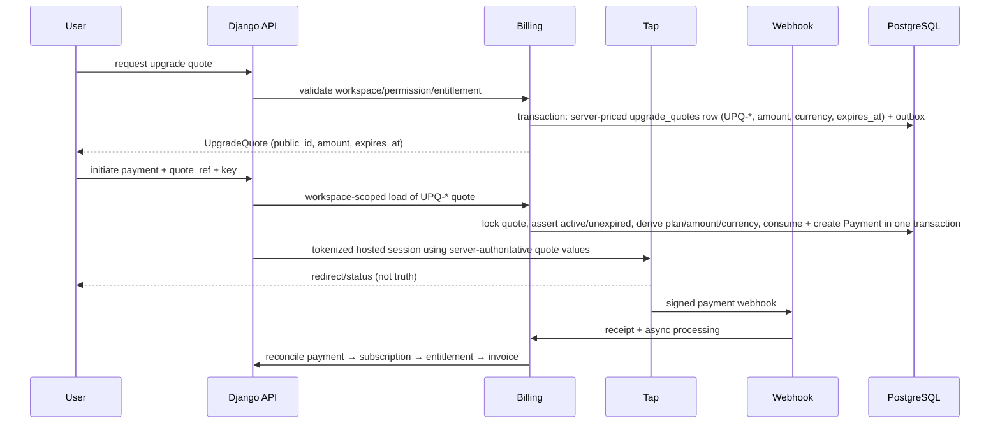

# WazLink Backend Architecture & Documentation

> **B0 status:** Architecture and contracts only. Backend coding is not authorized. This document is normative for future backend implementation agents.

**Frontend reference:** `30bc15e9ca3c0205df2b49e792fce1b8e78a36b1`  
**Scope:** Django + PostgreSQL backend design; no production implementation, migrations, endpoints, provider calls, secrets, infrastructure, or frontend changes are included in B0.

## Core sequences

The quote is the commercial source of truth in that sequence: client-supplied amount and currency are validated mirrors and never reach the provider request. Revenue recognition is a separate sequence: an authorized actor/system submits `RecordRevenueEvent`; the Revenue service validates source, amount, currency, idempotency, and relations, then commits RevenueEvent and outbox. `DealWon` alone ends without that write.
