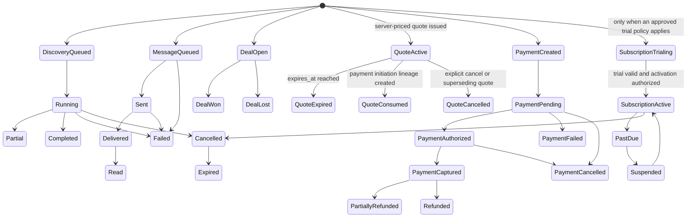

# WazLink Backend Architecture & Documentation

> **B0 status:** Architecture and contracts only. Backend coding is not authorized. This document is normative for future backend implementation agents.

**Frontend reference:** `30bc15e9ca3c0205df2b49e792fce1b8e78a36b1`  
**Scope:** Django + PostgreSQL backend design; no production implementation, migrations, endpoints, provider calls, secrets, infrastructure, or frontend changes are included in B0.

## State machines

Discovery transitions require a valid job owner and idempotency key. Business→Lead is explicit and idempotent; viewing results never creates a Lead. Deal transitions permit `open→won` or `open→lost` only with permission and confirmation; Won probability is 100 and Lost is 0. RevenueEvent has its own `pending/recognized/reversed` lifecycle and is not a Deal state. SubscriptionTrialing is conditional, not the default for every subscription: it requires an approved trial policy, a recorded trial end, and a valid entitlement basis. Payment failure transitions to a payment failure/past-due state and cannot silently activate or extend a subscription.
UpgradeQuote uses `active→expired`, `active→consumed`, or `active→cancelled`; `active` is the only state that may initiate a payment, and `expired`, `consumed`, and `cancelled` are terminal. Expiry is evaluated server-side against `expires_at` at use time, never trusted from the client. Consumption is the transactional creation of exactly one payment lineage: the quote row is locked, checked for `active` and unexpired, transitioned to `consumed` with `consumed_at` and `payment_id` set, and the Payment is created in the same transaction, so a concurrent second attempt against the same quote loses the unique constraint and receives `409 CONFLICT`. A retry carrying the same `Idempotency-Key` and body replays the original result and is not a second consumption. Payment uses provider-neutral states `created→pending→authorized→captured`, terminal `failed` or `cancelled`, and captured-payment outcomes `partially_refunded` or `refunded`; Tap-specific status mapping remains unresolved pending provider-contract validation. AutomationRun is `created→awaiting_approval→queued→running→completed/failed/cancelled`; sensitive actions cannot skip approval. WebhookReceipt is `received→verified→queued→processed/failed/duplicate`. FileAsset is `pending→available/quarantined/failed→archived`. TaxInvoice states are conceptual and must be validated against official ZATCA terminology before implementation.
