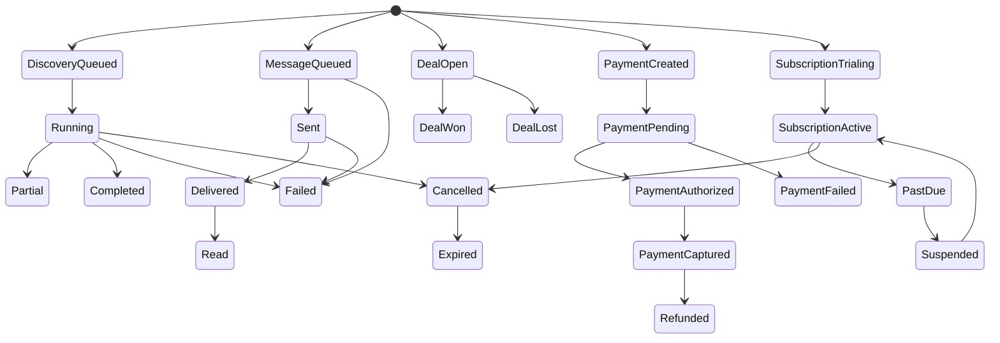

# WazLink Backend Architecture & Documentation

> **B0 status:** Architecture and contracts only. Backend coding is not authorized. This document is normative for future backend implementation agents.

**Frontend reference:** `30bc15e9ca3c0205df2b49e792fce1b8e78a36b1`  
**Scope:** Django + PostgreSQL backend design; no production implementation, migrations, endpoints, provider calls, secrets, infrastructure, or frontend changes are included in B0.

## State machines

Discovery transitions require a valid job owner and idempotency key. Business→Lead is explicit and idempotent; viewing results never creates a Lead. Deal transitions permit `open→won` or `open→lost` only with permission and confirmation; Won probability is 100 and Lost is 0. RevenueEvent has its own `pending/recognized/reversed` lifecycle and is not a Deal state.

AutomationRun is `created→awaiting_approval→queued→running→completed/failed/cancelled`; sensitive actions cannot skip approval. WebhookReceipt is `received→verified→queued→processed/failed/duplicate`. FileAsset is `pending→available/quarantined/failed→archived`. TaxInvoice states are conceptual and must be validated against official ZATCA terminology before implementation.
