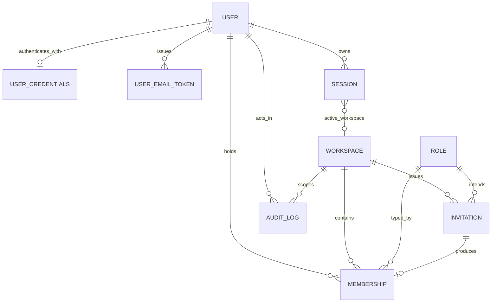

# B1 — Identity Data Model (logical target)

> **B1 status:** Logical design on paper. **No SQL, no migrations, no Django models are authorized.** Every table below is a *logical* description for a future implementation agent.

**Inherited from B0 `BACKEND_DATA_MODEL.md`:** all tables use UUIDv7 `id` internally, an immutable prefixed `public_id`, UTC `created_at`/`updated_at`, optional `archived_at`, and `workspace_id` for tenant-owned records. Money is `NUMERIC(19,4)`; JSONB is allowed only for provider metadata, raw snapshots, structured flexible metadata, and before/after audit details.

## 1. Public-ID prefixes

| Prefix | Resource | Status | Source |
|---|---|---|---|
| `WORK-` | Workspace | **Frozen B0 section A** | `BACKEND_PUBLIC_ID_REGISTRY.md` |
| `USR-` | User | **Frozen B0 section A** | `BACKEND_PUBLIC_ID_REGISTRY.md` |
| `SES-` | Session | **Frozen B0 section A** | `BACKEND_PUBLIC_ID_REGISTRY.md` |
| `AUD-` | AuditLog | **Frozen B0 section A** | `BACKEND_PUBLIC_ID_REGISTRY.md` |
| `PLAN-` | Plan (global bounded catalog) | **Frozen B0 section A** | `BACKEND_PUBLIC_ID_REGISTRY.md` |
| `MEM-` | Membership | **B1-PROPOSED / RESERVED — not registered** | B1 decision `B1-D-002` |
| `WINV-` | WorkspaceInvitation | **B1-PROPOSED / RESERVED — not registered** | B1 decision `B1-D-003` |

`WORK-`, `USR-`, `SES-` are Foundation identifiers explicitly frozen for B1; no alternative prefix may be invented for them.

**`MEM-` and `WINV-` are PROPOSED / RESERVED TARGET prefixes. They are NOT registered canonical B0 prefixes.** B1 does not register, add, or mint them. `BACKEND_PUBLIC_ID_REGISTRY.md` section A is unmodified by B1 and contains neither prefix.

B1 *proposes* them through the extension mechanism the registry itself defines: "Any new canonical prefix requires an ADR update, API/DTO update, index update, and traceability entry **before implementation**" (registry, Cross-domain invariants). That procedure is a gated pre-implementation contract step (`B1-D-002`, `B1-D-003`, Class B) requiring CTO approval.

**Until `BACKEND_PUBLIC_ID_REGISTRY.md` is formally extended, no implementation may mint either prefix.** Because the registry itself scopes registration to "before implementation" rather than before design, this does not block B1 design closure (`PUBLIC_ID_REGISTRY_BLOCKS_B1 = NO`).

**Why not reuse `INV-`:** `INV-` is a B0 section-B frontend fixture prefix, and the registry states it "must never be used for platform invoices, whose canonical prefix is `INV-BILL-*`". Promoting `INV-` would reclassify a closed section-B row and create a lookalike hazard against `INV-BILL-`. `WINV-` is disjoint from both and carries no B0 history.

## 2. `users` — global identity (NOT tenant-owned)

| Column | Type | Notes |
|---|---|---|
| `id` | UUIDv7 PK | internal identity, never exposed |
| `public_id` | text | `USR-<opaque>`, immutable, **globally unique** |
| `email` | citext | raw submitted address, preserved |
| `email_normalized` | citext | lowercased, whitespace-trimmed; **uniqueness key** |
| `email_verified_at` | timestamptz null | null ⇒ unverified |
| `display_name` | text | required, 1–120 chars |
| `title` | text null | free-text job title (frontend `user.role` migrates here); display only, never authorization |
| `locale` | text | default `ar-SA` (frozen frontend `workspaceLocales`) |
| `timezone` | text | default `Asia/Riyadh` |
| `status` | text | `active` \| `disabled` \| `deleted` |
| `last_login_at` | timestamptz null | set on successful session creation |
| `last_active_workspace_id` | UUID null FK → `workspaces.id` | **hint only**, never an authorization input |
| `failed_login_count` | integer | monotonic counter for lockout/alerting |
| `version` | integer ≥ 1 | ADR-010 optimistic concurrency |
| `created_at` / `updated_at` | timestamptz | UTC |
| `deleted_at` | timestamptz null | anonymization marker, not a hard delete |

**Explicitly absent:** `workspace_id`. A User is global. **`users` is the only identity table without a tenant column.**

- **Unique:** `public_id`; `email_normalized` (partial, `WHERE status <> 'deleted'`).
- **Check:** `status IN ('active','disabled','deleted')`; `version >= 1`; `email_normalized = lower(btrim(email_normalized))`.
- **Index:** `(status)`, `(last_active_workspace_id)`, `(email_normalized)`.
- **Immutable after creation:** `id`, `public_id`, `created_at`.
- **Normalization rule:** B0 `BACKEND_DATA_GOVERNANCE.md` requires that "email normalization must not silently alter local-part semantics". Therefore normalization is **lowercase + trim only**. No dot-stripping, no plus-tag stripping, no provider-specific rules.
- **Deletion/retention:** never hard-deleted while any audit, financial, or tax record references the actor. `status='deleted'` sets `deleted_at`, clears `display_name`/`title`/`email` to a stable pseudonym, retains `public_id` for referential/audit integrity, revokes all sessions, and transitions every Membership to `removed`. Retention durations are a **PRODUCT / LEGAL DECISION REQUIRED** (inherited from B0, unresolved).

### `user_credentials` (1:1 with `users`)

| Column | Notes |
|---|---|
| `user_id` | PK/FK → `users.id`, `ON DELETE RESTRICT` |
| `password_hash` | Django approved hasher output; **never** returned, logged, or audited |
| `password_updated_at` | timestamptz; a change revokes all other sessions |
| `password_algorithm` | recorded for rehash-on-login |

Separated from `users` so that ordinary user reads never load the hash and so that column-level access can be restricted.

### `user_email_tokens` (verification and password reset)

| Column | Notes |
|---|---|
| `id` / `user_id` | FK → `users.id` |
| `purpose` | `email_verification` \| `password_reset` |
| `token_hash` | SHA-256 of the raw token; **the raw token is never stored**. The raw token is a **≥256-bit CSPRNG** opaque value, URL-safe encoded, with no user-derived, sequential, timestamp-derived, or otherwise guessable component — the same construction and entropy floor as the invitation token (§5). SHA-256 without stretching is correct **because** the input is high-entropy: no salt, pepper, or KDF is required or permitted, and none is specified. |
| `expires_at` | timestamptz; verification 72h, reset 60min |
| `consumed_at` | timestamptz null; single-use |
| `requested_ip_hash` / `requested_user_agent_digest` | privacy-reduced request metadata |

- **Unique:** `token_hash`. **Index:** `(user_id, purpose, consumed_at)`.
- Issuing a new token of a purpose consumes all prior unconsumed tokens of that purpose for that user.
- **Handling.** The raw token is delivered only through the notification boundary (`B1_COMMAND_EVENT_CATALOG.md` §3.3) and is never returned by an API response, written to a log, recorded in `audit_logs`, placed in an event payload or the outbox, or passed as a Celery argument. `token_hash` is nulled when the row reaches a consumed or expired state, so a leaked database backup cannot be replayed.

## 3. `workspaces` — the tenant

| Column | Type | Notes |
|---|---|---|
| `id` | UUIDv7 PK | |
| `public_id` | text | `WORK-<opaque>`, immutable, globally unique |
| `name` | text | required, 1–120 chars, mutable, audited |
| `slug` | — | **not modelled**; see `B1-D-004` |
| `status` | text | `active` \| `suspended` \| `archived` \| `deleting` (B0 vocabulary, verbatim) |
| `timezone` | text | default `Asia/Riyadh`; drives period/report boundaries (ADR-011) |
| `currency` | text | ISO-4217, default `SAR` |
| `locale` | text | default `ar-SA` |
| `created_by_user_id` | UUID FK → `users.id` | provenance, immutable |
| `suspended_at` / `suspended_reason` | timestamptz null / text null | |
| `archived_at` | timestamptz null | |
| `deletion_requested_at` / `deletion_requested_by` | timestamptz null / UUID null | |
| `version` | integer ≥ 1 | |
| `created_at` / `updated_at` | timestamptz | |

- **Unique:** `public_id`. **Check:** `status IN ('active','suspended','archived','deleting')`; `currency ~ '^[A-Z]{3}$'`.
- **Index:** `(status)`, `(created_by_user_id)`.
- **Immutable:** `id`, `public_id`, `created_by_user_id`, `created_at`.
- **Retention:** `deleting` never triggers a cascade delete of financial, tax, or audit records. B0 forbids casual deletion of financial/tax/audit/webhook rows; the purge job anonymizes CRM PII and preserves legally retained records.

## 4. `memberships` — the authoritative User↔Workspace link (tenant-owned)

| Column | Type | Notes |
|---|---|---|
| `id` | UUIDv7 PK | |
| `public_id` | text | `MEM-<opaque>`, immutable |
| `workspace_id` | UUID FK → `workspaces.id` `ON DELETE RESTRICT` | tenant column |
| `user_id` | UUID FK → `users.id` `ON DELETE RESTRICT` | |
| `role` | text FK → `roles.code` | `owner`\|`admin`\|`manager`\|`sales`\|`member`\|`viewer` |
| `status` | text | `active` \| `suspended` \| `removed` |
| `invited_by_user_id` | UUID null FK → `users.id` | null for the founding owner |
| `invitation_id` | UUID null FK → `invitations.id` | provenance of the join |
| `joined_at` | timestamptz | creation instant (acceptance or founding) |
| `activated_at` | timestamptz null | most recent transition into `active` |
| `suspended_at` | timestamptz null | |
| `removed_at` | timestamptz null | |
| `version` | integer ≥ 1 | ADR-010 |
| `created_at` / `updated_at` | timestamptz | |

- **Unique:** `public_id`; **partial unique `(workspace_id, user_id) WHERE status <> 'removed'`** — one live membership per user per workspace, while preserving removed history and permitting re-invitation.

  > **B1 refinement of a B0 constraint — B0 does not contain this partial-index detail.** `BACKEND_DATA_MODEL.md` states the constraint as a plain "membership workspace/user unique". Read literally, a full unique index would make re-invitation after removal impossible without deleting the removed row, which B0's own retention doctrine forbids ("append-oriented and not casually deleted"; "anonymize rather than erase relational history"). B1 therefore narrows the index to live rows only.
  >
  > The *intent* of the B0 constraint is preserved exactly — a user may hold at most **one live membership** per workspace — while `removed` rows are retained so audit trails, historical assignment references, and `invitation_id` provenance stay resolvable. Re-invitation creates a **new** `MEM-*` row rather than reviving a terminal one, so history is never rewritten.
  >
  > This narrowing is a B1 target refinement, not an existing B0 statement, and travels in the B1 implementation-contract amendment bundle alongside `B1-D-002`/`B1-D-003`/`B1-D-019` (`B1-D-021`, Class B).
- **Partial unique for owner protection:** none at the column level; last-owner protection is a transactional guard (see `B1_WORKSPACE_MEMBERSHIP_MODEL.md` §5) because SQL cannot express "at least one".
- **Check:** `status IN ('active','suspended','removed')`; `role IN (...6 codes...)`; `version >= 1`; `status='removed' ⇒ removed_at IS NOT NULL`.
- **Index:** `(workspace_id, status)`, `(user_id, status)` — the second index is the hot path for active-workspace resolution and `GET /workspaces`; `(workspace_id, role) WHERE status='active'` supports the owner-count guard.
- **Immutable:** `id`, `public_id`, `workspace_id`, `user_id`, `joined_at`.
- **Retention:** `removed` rows are retained, never deleted, so audit and historical assignment references stay resolvable.

## 5. `invitations` — workspace-scoped, expiring (tenant-owned)

| Column | Type | Notes |
|---|---|---|
| `id` | UUIDv7 PK | |
| `public_id` | text | `WINV-<opaque>`, immutable |
| `workspace_id` | UUID FK → `workspaces.id` | tenant column |
| `email_normalized` | citext | lowercase+trim, same rule as `users` |
| `role` | text FK → `roles.code` | intended role; `owner` is **forbidden** at invite time |
| `token_hash` | text | SHA-256 of a ≥256-bit CSPRNG token; **raw token never stored** |
| `status` | text | `pending` \| `accepted` \| `cancelled` \| `expired` |
| `invited_by_user_id` | UUID FK → `users.id` | |
| `expires_at` | timestamptz | issue + 7 days |
| `accepted_at` / `accepted_by_user_id` | timestamptz null / UUID null | |
| `cancelled_at` / `cancelled_by_user_id` | timestamptz null / UUID null | |
| `resend_count` | integer default 0 | rate-limit / abuse signal |
| `version` | integer ≥ 1 | |
| `created_at` / `updated_at` | timestamptz | |

- **Unique:** `public_id`; `token_hash`; **partial unique `(workspace_id, email_normalized) WHERE status='pending'`** — at most one live invitation per email per workspace, which makes "duplicate invite" a deterministic `409`.
- **Check:** `status IN ('pending','accepted','cancelled','expired')`; `role <> 'owner'`; `expires_at > created_at`.
- **Index:** `(workspace_id, status)`, `(email_normalized, status)`, `(expires_at) WHERE status='pending'` for the expiry sweep.
- **Immutable:** `id`, `public_id`, `workspace_id`, `email_normalized`, `invited_by_user_id`, `created_at`. **Mutable:** `role` (until accepted), `status`, `token_hash` (on resend), `expires_at` (on resend), `resend_count`, `version`.
- **Retention:** terminal invitations are retained for audit; `token_hash` is nulled on reaching a terminal state so a leaked database backup cannot be replayed.

## 6. `sessions` — user-bound, workspace-aware (NOT tenant-owned)

| Column | Type | Notes |
|---|---|---|
| `id` | UUIDv7 PK | |
| `public_id` | text | `SES-<opaque>`, immutable — this is the OpenAPI `Session.session_id` |
| `user_id` | UUID FK → `users.id` `ON DELETE RESTRICT` | |
| `session_key_hash` | text | SHA-256 of the Django session key; **the key itself is never stored here and never logged** |
| `active_workspace_id` | UUID **null** FK → `workspaces.id` | **the authoritative tenant selector.** `NULL` is legal in exactly one case — the owning User has `|E(U)| = 0` (`B1_AUTH_SESSION_DESIGN.md` §4.6.2, invariant SESS-1). A row with `NULL` is not usable for any tenant-scoped operation: every such request terminates at authorization pipeline step 5 with `404 WORKSPACE_NOT_FOUND`. It is never null transiently, never null pre-authentication, and never null as an unset placeholder. |
| `status` | text | `active` \| `expired` \| `revoked` |
| `created_at` | timestamptz | |
| `last_seen_at` | timestamptz | updated at most once per minute to bound write amplification |
| `idle_expires_at` | timestamptz | `last_seen_at + idle window` |
| `absolute_expires_at` | timestamptz | `created_at + absolute window`; never extended |
| `revoked_at` / `revoked_reason` | timestamptz null / text null | `user_logout`\|`global_logout`\|`password_change`\|`admin_revoke`\|`user_disabled`\|`membership_removed`\|`workspace_deleting` |
| `ip_hash` | text | keyed hash of the client IP, not the IP |
| `user_agent_digest` | text | truncated/normalized UA family, not the raw string |
| `version` | integer ≥ 1 | |

- **Unique:** `public_id`; `session_key_hash`.
- **Check:** `status IN ('active','expired','revoked')`; `absolute_expires_at > created_at`.
- **Index:** `(user_id, status)` — powers "list my sessions" and "revoke all"; `(status, idle_expires_at)` for the sweeper; `(active_workspace_id) WHERE status='active'` for workspace-scoped revocation.
- **`sessions` is NOT tenant-owned.** It is user-owned and *points at* a workspace. A session row is therefore never returned by a workspace-scoped queryset; session listing is scoped by `user_id` only.
- **Django relationship:** the Django session store remains the cookie transport. `sessions` is the authoritative WazLink session registry required for enumeration, listing, and revocation. Revocation writes both: the registry row transitions to `revoked` **and** the Django session record is destroyed, in the same transaction. A request whose Django session has no `active` registry row is rejected with `401 SESSION_REVOKED`.

## 7. `roles` — bounded global catalog

| Column | Notes |
|---|---|
| `code` | PK, one of `owner, admin, manager, sales, member, viewer` |
| `rank` | integer: owner=60, admin=50, manager=40, sales=30, member=20, viewer=10 |
| `is_assignable_by_invite` | boolean — false for `owner` |
| `display_name_ar` / `display_name_en` | presentation only |

- Global catalog, **not** tenant-owned — consistent with B0's "global catalogs such as Plans and Capabilities are explicitly global".
- `rank` is used only for the "cannot grant or revoke a role at or above your own rank" guard. It is **not** a permission hierarchy: permissions are explicit grants, never inherited by rank.
- **Permission storage:** Phase 1 stores the role→permission matrix as a versioned code constant, not as rows. There are no custom roles in Phase 1 (`B1-D-009`, Class C), so a mutable `role_permissions` table would add a mutation surface with no product requirement and would create a second source of truth for authorization. The constant's version is recorded in every authorization audit record so a decision is reproducible.

## 8. ERD (logical)

Conceptual only. No migration or executable schema is authorized in B1.

## 9. Tenancy classification summary

| Table | Tenant-owned (`workspace_id`) | Rationale |
|---|---|---|
| `users` | **No** | Global identity; one email, many workspaces |
| `user_credentials` | **No** | Belongs to the global user |
| `user_email_tokens` | **No** | Pre-tenant flows (verification, reset) |
| `sessions` | **No** (references a workspace) | User-bound; must survive workspace switching |
| `workspaces` | **Is** the tenant | |
| `memberships` | **Yes** | |
| `invitations` | **Yes** | |
| `roles` | **No** (global catalog) | Matches B0's global-catalog rule |
| `audit_logs` | **Yes** (nullable for pre-tenant auth events) | See `B1_PRIVACY_AUDIT_MODEL.md` §3 |
