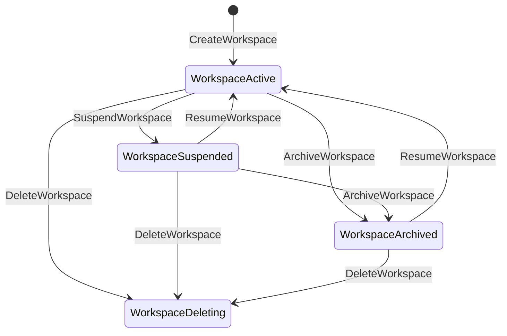
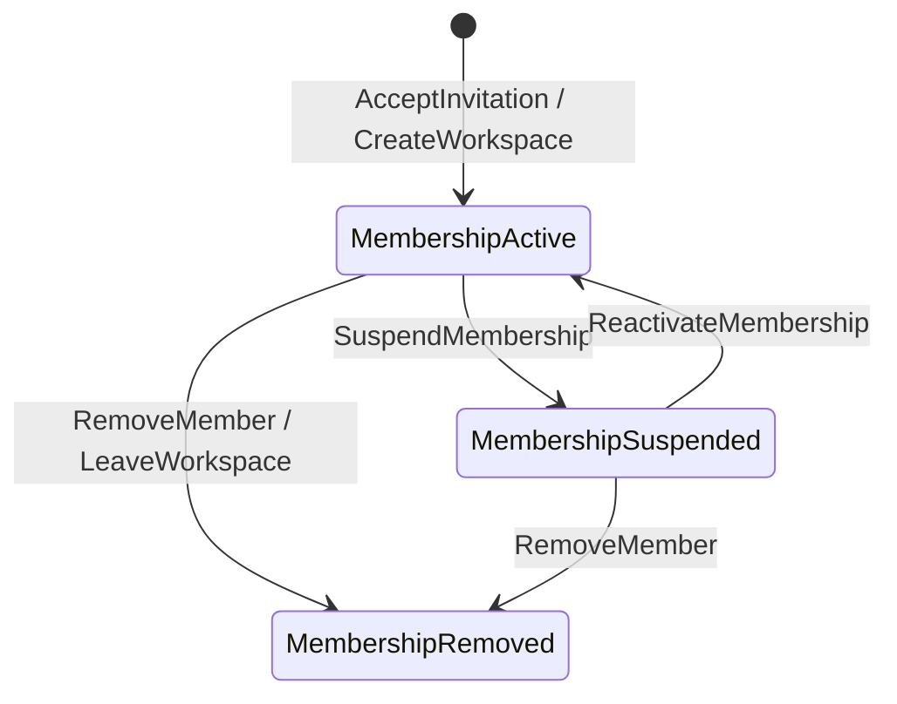
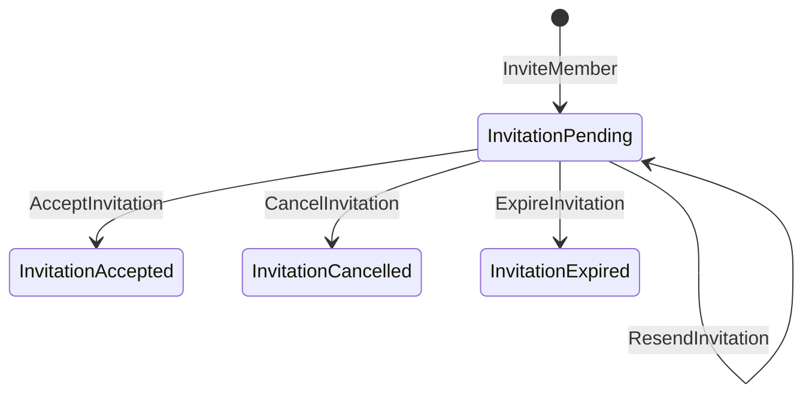
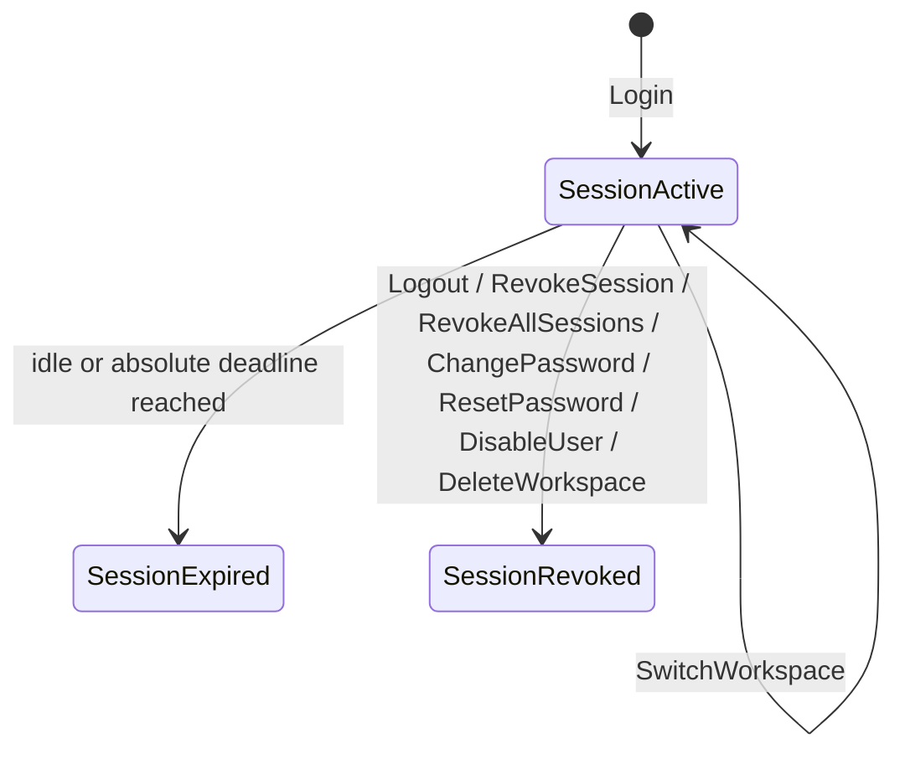
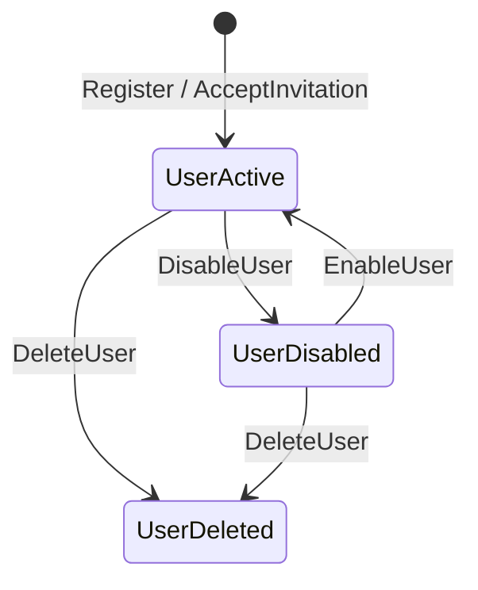

# B1 — Tenant & Identity State Machines

> **B1 status:** Target design only. Every transition below is total and unambiguous: for a given (state, command) pair there is exactly one outcome.

State names are unique across aggregates except where a name is deliberately shared with an identical meaning. No aggregate reuses another's state name with a different meaning.

| Aggregate | States | Terminal |
|---|---|---|
| Workspace | `active`, `suspended`, `archived`, `deleting` | `deleting` |
| Membership | `active`, `suspended`, `removed` | `removed` |
| Invitation | `pending`, `accepted`, `cancelled`, `expired` | `accepted`, `cancelled`, `expired` |
| Session | `active`, `expired`, `revoked` | `expired`, `revoked` |
| User | `active`, `disabled`, `deleted` | `deleted` |

## 1. Workspace

| Current | Command | Guard | Next | Event | Audit | Failure |
|---|---|---|---|---|---|---|
| — | `CreateWorkspace` | verified user; `seats` quota ≥1 | `active` | `WorkspaceCreated` | `workspace.created` | `403 QUOTA_EXHAUSTED` / `403 EMAIL_VERIFICATION_REQUIRED` |
| `active` | `UpdateWorkspace` | `workspace.manage` + `If-Match` | `active` | `WorkspaceUpdated` | `workspace.updated` | `409 STALE_VERSION` |
| `active` | `SuspendWorkspace` | Owner + `If-Match` | `suspended` | `WorkspaceSuspended` | `workspace.suspended` | `409 STALE_VERSION` |
| `suspended` | `ResumeWorkspace` | Owner + `If-Match` | `active` | `WorkspaceResumed` | `workspace.resumed` | `409 STALE_VERSION` |
| `archived` | `ResumeWorkspace` | Owner + `If-Match` + entitlement re-check | `active` | `WorkspaceResumed` | `workspace.resumed` | `403 ENTITLEMENT_LOCKED` |
| `active`\|`suspended` | `ArchiveWorkspace` | Owner + `If-Match` | `archived` | `WorkspaceArchived` | `workspace.archived` | `409 STALE_VERSION` |
| `active`\|`suspended`\|`archived` | `DeleteWorkspace` | Owner + `If-Match` + `Idempotency-Key` + INV-USER-1 holds for the actor afterwards | `deleting` | `WorkspaceDeletionRequested` | `workspace.deletion_requested` | `409 CONFLICT` (`last_workspace`) |
| `deleting` | any | — | `deleting` | — | — | `403 WORKSPACE_INACTIVE` |
| `suspended`\|`archived` | any unsafe tenant operation | — | unchanged | — | — | `403 WORKSPACE_INACTIVE` |
| `active` | `SuspendWorkspace` twice | idempotent guard | `suspended` | not re-emitted | — | `409 STALE_VERSION` on the second |

## 2. Membership

| Current | Command | Guard | Next | Event | Audit | Failure |
|---|---|---|---|---|---|---|
| — | `AcceptInvitation` | invitation `pending`, unexpired; workspace `active`; no live membership; `seats` quota | `active` | `MembershipActivated` | `membership.activated` | `409 ALREADY_MEMBER` / `403 QUOTA_EXHAUSTED` |
| — | `CreateWorkspace` | founder | `active` (`owner`) | `MembershipActivated` | `membership.activated` | — |
| `active` | `ChangeMemberRole` | `member.role.change`; rank guards; never self; new role ≠ `owner`; INV-WS-1 after change | `active` | `MemberRoleChanged` | `membership.role_changed` | `403 PERMISSION_DENIED` / `409 LAST_OWNER_REQUIRED` / `409 STALE_VERSION` |
| `active` | `SuspendMembership` | `member.suspend`; never self; INV-WS-1; **INV-USER-1 for the target** | `suspended` | `MembershipSuspended` | `membership.suspended` | `409 LAST_OWNER_REQUIRED` / `409 CONFLICT` (`last_active_membership`) |
| `suspended` | `ReactivateMembership` | `member.suspend`; user `active`; `seats` quota | `active` | `MembershipActivated` | `membership.activated` | `403 QUOTA_EXHAUSTED` |
| `active`\|`suspended` | `RemoveMember` | `member.remove`; INV-WS-1; **if self, INV-USER-1**; not enforced on another member (§3.1 exception) | `removed` | `MembershipRemoved` | `membership.removed` | `409 LAST_OWNER_REQUIRED` / `409 CONFLICT` (`last_active_membership`, self only) |
| `active`\|`suspended` | `LeaveWorkspace` | self; INV-WS-1; **INV-USER-1** | `removed` | `MembershipRemoved` | `membership.removed` | `409 LAST_OWNER_REQUIRED` / `409 CONFLICT` (`last_active_membership`) |
| `removed` | any | terminal | `removed` | — | — | `404 ENTITY_NOT_FOUND` |
| any | `TransferOwnership` (as target) | target `active`; actor active Owner | `active` (`owner`) | `OwnershipTransferred` | `ownership.transferred` | `409 CONFLICT` if target not `active` |

A `removed` membership is never revived. Re-inviting the same user creates a **new** `MEM-*` row.

## 3. Invitation

| Current | Command | Guard | Next | Event | Audit | Failure |
|---|---|---|---|---|---|---|
| — | `InviteMember` | `member.invite`; workspace `active`; role assignable, ≠ `owner`, below actor rank; target not a live member; no `pending` invitation for that email | `pending` | `MemberInvited` | `invitation.created` | `409 ALREADY_MEMBER` / `409 CONFLICT` (`invitation_pending`) / `403 WORKSPACE_INACTIVE` |
| `pending` | `ResendInvitation` | `invitation.resend`; rate limit **5 / invitation / 24h** and **20 / workspace / hour** | `pending` (token rotated, previous token dead, `expires_at` extended, `resend_count`+1) | `InvitationResent` | `invitation.resent` | `429 RATE_LIMITED` with `Retry-After` |
| `pending` | `AcceptInvitation` | `now < expires_at`; caller's `email_normalized` matches; workspace `active`; no live membership; `seats` quota | `accepted` | `InvitationAccepted` | `invitation.accepted` | `409 INVITATION_EXPIRED` / `403 PERMISSION_DENIED` (email mismatch) / `409 ALREADY_MEMBER` |
| `pending` | `CancelInvitation` | `invitation.cancel` + `If-Match` | `cancelled` (token_hash nulled) | `InvitationCancelled` | `invitation.cancelled` | `409 STALE_VERSION` |
| `pending` | `ExpireInvitation` (system sweep) | `now ≥ expires_at` | `expired` (token_hash nulled) | `InvitationExpired` | `invitation.expired` (actor `system:scheduler`) | — |
| `accepted` | `AcceptInvitation` | terminal | `accepted` | — | — | `409 INVITATION_ALREADY_ACCEPTED` |
| `cancelled` | `AcceptInvitation` | terminal | `cancelled` | — | — | `409 INVITATION_CANCELLED` |
| `expired` | `AcceptInvitation` | terminal | `expired` | — | — | `409 INVITATION_EXPIRED` |
| `accepted`\|`cancelled`\|`expired` | `CancelInvitation` / `ResendInvitation` | terminal | unchanged | — | — | `409` with the matching terminal code |
| any | unknown/invalid token | — | unchanged | — | `auth.invitation_token_rejected` | `404 ENTITY_NOT_FOUND` |

**Expiry is evaluated inline at acceptance as well as by the sweep**, so a delayed sweeper can never permit a stale acceptance.

## 4. Session

| Current | Command / trigger | Guard | Next | Event | Audit | Failure |
|---|---|---|---|---|---|---|
| — | `Login` | credentials valid; user `active`. Workspace resolution is **total** and never blocks login: `active_workspace_id` is an eligible workspace, or `NULL` when `\|E(U)\| = 0` (`B1_AUTH_SESSION_DESIGN.md` §4.2, §4.6) | `active` | `SessionCreated` | `auth.login_succeeded` | `401 INVALID_CREDENTIALS` / `429 RATE_LIMITED` — **these are the only login failures** |
| `active` | request received | `now < idle_expires_at` and `now < absolute_expires_at` | `active` (idle slid) | — | — | → `expired` |
| `active` | deadline reached, inline at validation or via the `ExpireSessions` sweep | — | `expired` | `SessionExpired` | `auth.session_expired` | `401 AUTH_REQUIRED` |
| `active` | `SwitchWorkspace` | target workspace eligible | `active` (`active_workspace_id` changed) | `ActiveWorkspaceSwitched` | `session.workspace_switched` | `404 WORKSPACE_NOT_FOUND` |
| `active` | `Logout` | self | `revoked(user_logout)` | `SessionRevoked` | `auth.logout` | — |
| `active` | `RevokeSession` | session belongs to caller | `revoked(admin_revoke\|user_logout)` | `SessionRevoked` | `auth.session_revoked` | `404 ENTITY_NOT_FOUND` |
| `active` | `RevokeAllSessions` | self | `revoked(global_logout)` | `SessionRevoked`×N | `auth.sessions_revoked_all` | — |
| `active` | `ChangePassword` / `ResetPassword` | — | `revoked(password_change)` | `SessionRevoked` | `auth.password_changed` | — |
| `active` | `DisableUser` / `DeleteUser` | — | `revoked(user_disabled)` | `SessionRevoked` | `user.disabled` | — |
| `active` | `DeleteWorkspace` (matching `active_workspace_id`) | — | `revoked(workspace_deleting)` | `SessionRevoked` | `workspace.deletion_requested` | — |
| `active` | last eligible membership removed | re-resolution finds an empty set | `revoked(membership_removed)` | `SessionRevoked` | `session.revoked_no_workspace` | `401 SESSION_REVOKED`. The global User stays `active` and may sign in again into a no-workspace session (§4.6). |
| `expired`\|`revoked` | any | terminal | unchanged | — | — | `401 AUTH_REQUIRED` / `401 SESSION_REVOKED` |
| `expired`\|`revoked` | `Logout` | — | unchanged | — | — | `204` (idempotent, deliberately not `401`) |

## 5. User

| Current | Command | Guard | Next | Event | Audit | Failure |
|---|---|---|---|---|---|---|
| — | `Register` | email unused among non-deleted users | `active` (unverified) | `UserRegistered` | `auth.registered` | `202` regardless (anti-enumeration) |
| `active` | `VerifyEmail` | valid unconsumed token | `active` (verified) | `UserEmailVerified` | `auth.email_verified` | `400 VALIDATION_ERROR` |
| `active` | `DisableUser` | operator action; not the sole active Owner of a non-`deleting` workspace without an alert | `disabled` | `UserDisabled` | `user.disabled` | `409 LAST_OWNER_REQUIRED` |
| `disabled` | `EnableUser` | operator action | `active` | `UserEnabled` | `user.enabled` | — |
| `active`\|`disabled` | `DeleteUser` | not the sole active Owner of any non-`deleting` workspace | `deleted` (pseudonymized) | `UserDeleted` | `user.deleted` | `409 LAST_OWNER_REQUIRED` |
| `deleted` | any | terminal | `deleted` | — | — | `401 AUTH_REQUIRED` |

`DisableUser`, `EnableUser`, and `DeleteUser` are **platform-operator actions, not tenant-API operations**. No workspace role can disable or delete a global User; a workspace admin can only affect that user's Membership. This is the boundary that stops one tenant from denying a user access to another tenant.

## 6. Command → state-machine mapping

Of the **31** commands in `B1_COMMAND_EVENT_CATALOG.md`:

- **30 appear as a labelled transition in at least one machine above.**
- **`RequestPasswordReset` (1) is intentionally stateless and appears in none.** It issues a `user_email_tokens` row and hands a token to the delivery boundary. No aggregate changes state: the User stays `active`, no session is created or revoked, and it emits no domain event. That is exactly what lets it answer `202` unconditionally as the anti-enumeration endpoint.

`UNMAPPED_STATE_COMMANDS = 1`, and that one is documented, not accidental. **No document in this package may claim that every command is state-machine mapped.**

**`ResetPassword` is not in that category** and is not stateless. It replaces the credential and drives Session transitions — it is the trigger on row 6 of §4 above (`ChangePassword` / `ResetPassword` → `revoked(password_change)`). The *User* aggregate does not change state, because a password change is not an identity-state change, but the command is mapped.
