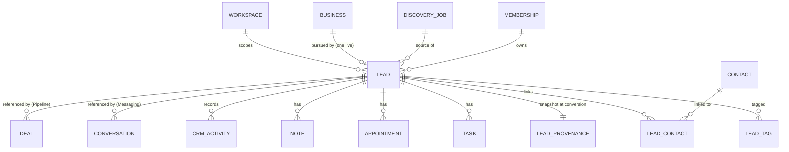

# B2 — The Lead Aggregate

> **B2 status:** Logical target design. **No SQL, no migrations, no Django models are authorized.** Every table below is a logical description.

Inherited from B0 `BACKEND_DATA_MODEL.md`: UUIDv7 `id`, immutable prefixed `public_id`, UTC `created_at`/`updated_at`, optional `archived_at`, `workspace_id` on every tenant-owned row, JSONB only for provider metadata, raw snapshots, structured flexible metadata, and before/after audit details.

## 1. `leads` — the CRM decision record

| Column | Type | Notes |
|---|---|---|
| `id` | UUIDv7 PK | internal, never exposed |
| `public_id` | text | `LEAD-<opaque>`, immutable, unique. **Registered in B0 registry section A.** |
| `workspace_id` | UUID FK → `workspaces.id` `ON DELETE RESTRICT` | tenant column (CRM-INV-1) |
| `business_id` | UUID FK → `businesses.id` `ON DELETE RESTRICT` | the Business this Lead pursues. **Immutable except by `BusinessMerged` re-pointing.** |
| `origin_type` | text | `discovery` only in Phase 1. Check constraint `origin_type IN ('discovery')`. |
| `source_job_id` | UUID null FK → `discovery_jobs.id` | the Discovery Job that led to conversion; nullable so an archived/purged Job cannot block the Lead |
| `owner_membership_id` | UUID FK → `memberships.id` `ON DELETE RESTRICT` | CRM-INV-16. `RESTRICT` is safe because B1 never deletes membership rows. |
| `status` | text | `new` \| `contacted` \| `qualified` \| `unqualified` \| `nurturing` |
| `priority` | text | `high` \| `medium` \| `low` |
| `last_activity_at` | timestamptz NOT NULL | maintained, monotonic (§4) |
| `next_activity_at` | timestamptz null | maintained projection over open Tasks (§5) |
| `converted_at` | timestamptz NOT NULL | instant of the conversion decision; immutable |
| `archived_at` | timestamptz null | archive lifecycle (§7) |
| `version` | integer ≥ 1 | ADR-010 optimistic concurrency |
| `created_at` / `updated_at` | timestamptz | UTC |

**Constraints and indexes**
- Unique `public_id`.
- **Partial unique `(workspace_id, business_id) WHERE archived_at IS NULL`** — CRM-INV-10, and the concrete form of B0's "business/workspace conversion unique".
- Check `status IN (...5 values...)`; `priority IN ('high','medium','low')`; `version >= 1`; `origin_type='discovery' ⇒ business_id IS NOT NULL`.
- Check `archived_at IS NULL OR archived_at >= converted_at`.
- Composite check enforcing `owner_membership.workspace_id = leads.workspace_id` (CRM-INV-16). PostgreSQL cannot express this across tables declaratively; it is enforced by the command guard plus a nightly integrity assertion, and is stated here so the implementer does not omit it.
- Indexes: `(workspace_id, status)`, `(workspace_id, owner_membership_id)` — B0's "lead/status/owner indexes"; plus `(workspace_id, last_activity_at DESC, public_id)`, `(workspace_id, next_activity_at)`, `(workspace_id, updated_at DESC, public_id)`, `(business_id)`, `(workspace_id, source_job_id)`.
- Immutable after creation: `id`, `public_id`, `workspace_id`, `origin_type`, `converted_at`, `created_at`.

**Explicitly absent** — and this list is normative, because every entry is a field a generic CRM would add and a field that would create a second authority:

`name`, `company_name`, `city`, `category`, `phone`, `email`, `website` (Business owns them, CRM-INV-3) · `score`, `tier`, `confidence`, `sales_approach`, `reasons`, `services` (AI owns them, CRM-INV-4) · `conversation_id`, `unread_count`, `last_message_at` (Messaging owns them, CRM-INV-5) · `deal_id`, `value`, `currency`, `stage`, `probability`, `expected_close_at` (Pipeline owns them, CRM-INV-6) · `revenue`, `attributed_revenue` (Revenue/Attribution own them, CRM-INV-7) · `company_id` (`CMP-` is a frozen-frontend fixture, `B2-D-A004`) · `contacted`, `last_contact_at` (§6) · `overdue_task_count`, `open_task_count` (derivable) · `deleted_at` (archive-only lifecycle, §7).

## 2. `lead_tags`

| Column | Notes |
|---|---|
| `id` / `workspace_id` | tenant column |
| `lead_id` | FK → `leads.id` `ON DELETE CASCADE` |
| `tag` | text, 1–40 chars, NFC-normalized, trimmed, case-preserved |
| `created_at` / `created_by_membership_id` | provenance of the tag |

Unique `(lead_id, tag)`. Index `(workspace_id, tag)` for the list filter. A tag is a **CRM relation, not a column**: the frozen fixture stores an array, but an array cannot be indexed for the `tag` filter without a GIN index whose semantics differ per PostgreSQL version, and it cannot record *who* tagged. Free-form tags are deliberately not constrained to a catalog — the frozen UI builds its option list from the loaded page (`Crm.tsx` `tags`), so no catalog exists to validate against.

## 3. `lead_provenance` — immutable conversion snapshot

See `B2_LEAD_PROVENANCE_DUPLICATION.md` §3. One row per Lead, written inside the conversion transaction, never updated.

## 4. `last_activity_at`

**Classification: `AUTHORITATIVE_PERSISTED` (maintained, monotonic).**

**Qualifying events — a closed set.** Anything not listed does not move `last_activity_at`.

| Source | Qualifying | Not qualifying |
|---|---|---|
| CRM | `LeadCreated`, `LeadStatusChanged`, `LeadPriorityChanged`, `LeadOwnerChanged`, `LeadTagAdded`, `LeadTagRemoved`, `ContactAdded`, `ContactUpdated`, `ContactRemoved`, `TaskCreated`, `TaskUpdated`, `TaskAssigned`, `TaskCompleted`, `TaskCancelled`, `AppointmentCreated`, `AppointmentRescheduled`, `AppointmentCancelled`, `AppointmentCompleted`, `AppointmentNoShowRecorded`, `NoteAdded`, `NoteRemoved` | `LeadArchived` (archiving is not activity on the Lead) |
| Messaging | `MessageSent`, `MessageReceived` | delivery-status transitions (`MessageDelivered`, `MessageFailed`) — a carrier receipt is not human activity |
| Pipeline | `DealCreated`, `DealStageChanged`, `DealWon`, `DealLost` | nothing |
| AI | — | `LeadIntelligenceCompleted` — a machine re-scoring a Business is not activity on the Lead (CRM-INV-12) |
| Discovery | — | `BusinessDiscovered`, re-crawl, `BusinessMerged` |
| System | — | timeline reads, projection refreshes, quota checks, audit writes |

**Update rule.** `last_activity_at := GREATEST(last_activity_at, occurred_at)`.
- CRM-owned events apply it **inside the mutating transaction**, so a CRM mutation and its activity date commit atomically.
- Cross-domain events apply it through an outbox consumer keyed by `(event_id)`. Out-of-order arrival cannot move the value backwards (CRM-INV-17).
- **Order safety is `GREATEST()` alone.** The maximum of a set is independent of the order its members arrive in, so no ordering mechanism is needed or permitted on top of it. A consumer **must not discard** an eligible qualifying event because of an aggregate version, a delivery position, or arrival order — B0's envelope carries no aggregate version to compare (`B2_COMMAND_EVENT_CATALOG.md` opening envelope statement, and §3 rule 7), and discarding would break recovery: an event recovered under `B2_TIMELINE_IDENTITY_MODEL.md` §5.5 is re-processed *after* later events from the same aggregate, yet carries the newest `occurred_at`. **Every eligible qualifying event is passed through `GREATEST()`, whatever order it arrives in.**
- **Reprocessing an already-applied logical event is idempotent**, because `GREATEST()` over an immutable `occurred_at` can neither regress nor double-count `last_activity_at`. This is the precise claim; the unconditional form "redelivery is a no-op" is **false** and is not asserted here. It holds **only after an eligible event has already been successfully applied**. A delivery previously rejected as `RETRYABLE_CLOCK_SKEW` (`B2_TIMELINE_IDENTITY_MODEL.md` §5.5) is **not** a no-op merely because the event has been seen before: it was never applied, its re-evaluation is exactly the recovery path, and it advances `last_activity_at` the first time it evaluates eligible.
- **A future-skewed delivery is never acknowledged as processed.** Admission (`B2_TIMELINE_IDENTITY_MODEL.md` §5.2) decides only whether `GREATEST()` may be applied; a rejection is a retryable processing failure, recovered by bounded automatic retry or by alerted dead-letter replay under §5.5. No permanent under-count of this column may arise solely because a delivery arrived future-dated.
- Initial value at conversion: `converted_at`.
- `last_activity_at` never decreases, including when the newest Task is cancelled or the newest Note is removed. Removing a record does not un-happen the activity.

**Divergence from the frozen frontend, stated deliberately.** `refreshLeadActivityDates` recomputes `lastActivityAt` as the newest surviving activity, so deleting an activity would move it backwards. It also overwrites `lead.updatedAt` with `lastActivityAt`. B2 keeps neither: `updated_at` tracks row modification (needed for the default `updated` sort and for cache correctness) and `last_activity_at` tracks business activity. Conflating them makes the default sort meaningless once cross-domain activity exists.

## 5. `next_activity_at`

**Classification: `DERIVED_PROJECTION` (materialized column).**

**Single authority:** the earliest `due_at` among the Lead's Tasks in status `pending`. Formally

```
next_activity_at(L) = MIN(t.due_at) over { t ∈ tasks : t.lead_id = L AND t.status = 'pending' AND t.archived_at IS NULL }
```

`NULL` when the set is empty. Tie-break for *display* of the next task: `(due_at ASC, task.public_id ASC)`.

**Appointments are deliberately excluded.** This is exactly the frozen behavior (`getLeadActivitySummary` reads only `getLeadTasks`), and it is kept rather than "improved" because merging two sources needs a tie-break policy the product has not made and would silently change every existing next-activity value. Recorded as `B2-D-C005` for a future product decision; if adopted it becomes `MIN(task.due_at, appointment.start_at)` with an explicit precedence rule and one new acceptance test.

**Maintenance.** Recomputed inside the same transaction as **every** Task mutation on that Lead (`CreateTask`, `UpdateTask` when `due_at` changes, `CompleteTask`, `CancelTask`). It is not time-dependent: a task passing its due date does not change `next_activity_at`, because that task is still the next thing to do. This guarantees `GET /leads` and `GET /leads/{id}/360` return the identical value with no join and no clock skew.

## 6. `contacted`

**Classification: `AUTHORITATIVE_PERSISTED` as a value of `status`, not as a field.**

Exhaustive search of the frozen tree finds **no** `contacted` boolean, **no** `lastContactAt`, and **no** contact-status field. "Contacted" is `leads.status = 'contacted'`, set by a human, and the summary tile counts exactly that (`getCrmSummary`).

Therefore:
- `has_been_contacted` — **`NOT_SUPPORTED`**. It would be a second encoding of `status`, and the two would drift the moment a user moved a Lead from `contacted` to `qualified`.
- `last_contact_at` — **`NOT_SUPPORTED`** in Phase 1.
- `contact_status` — **`NOT_SUPPORTED`**; it duplicates `status`.

**What does not qualify as contact, stated explicitly.** Creating a Task is **not** contact. Adding a Note is **not** contact. Scheduling an Appointment is **not** contact. An AI recommendation is **not** contact. Each of these is a *plan* to contact, and treating a plan as an outcome is the specific failure mode this section exists to prevent.

**Future path (Class C, `B2-D-C004`).** If the product later wants automatic contact detection, the qualifying set is `MessageSent` where the provider accepted the send, `MessageReceived` inbound, and `AppointmentCompleted`. It must then be an explicit projection column (`last_contact_at`) plus a *recommendation* surface — never a silent mutation of `status`, which would let Messaging change CRM state and violate CRM-INV-12 and domain ownership.

## 7. Archive lifecycle

`archived_at` is the only removal mechanism. There is no `DELETE /leads/{id}` and no `deleted_at`.

| Aspect | Behavior |
|---|---|
| Command | `ArchiveLead`, permission `lead.archive` (new, `B2-D-B004`), `If-Match` required |
| Effect | `archived_at = now()`; the Lead leaves `GET /leads` (unless `include_archived=true`) and leaves the duplicate-prevention index, so the Business may be converted again |
| Preconditions | none beyond authorization and version. Open Deals and open Conversations do **not** block archiving — CRM must not gate on another domain's state |
| Cascade | **none.** Contacts, Tasks, Appointments, Notes, and activities are retained and remain readable through `GET /leads/{id}/360`. Deals, Conversations, RevenueEvents, and Touchpoints are untouched |
| Mutations after archive | every CRM mutation on an archived Lead returns `409 CONFLICT` with `details.reason = "lead_archived"`, including its Tasks, Notes, Contacts, and Appointments |
| Reads after archive | `GET /leads/{id}`, `/360`, and `/timeline` still succeed. History stays legible |
| Un-archive | **`NOT_SUPPORTED`** in Phase 1 (`B2-D-C006`). Re-converting the Business produces a **new** `LEAD-*`, mirroring B1's re-invitation doctrine: history is never rewritten |
| Quota | `leads` usage is released on archive (`B2_AUTHORIZATION_ENTITLEMENT.md` §4) |

## 8. Field classification summary

| Field | Classification | Authority |
|---|---|---|
| `public_id`, `workspace_id`, `origin_type`, `converted_at`, `created_at` | `AUTHORITATIVE_PERSISTED` (immutable) | CRM |
| `status`, `priority`, `archived_at`, `version`, `updated_at` | `AUTHORITATIVE_PERSISTED` | CRM |
| `owner_membership_id` | `AUTHORITATIVE_PERSISTED` (EXTERNAL_DOMAIN_REFERENCE to B1) | CRM holds the choice; Workspace owns the Membership |
| `business_id`, `source_job_id` | `EXTERNAL_DOMAIN_REFERENCE` | Discovery |
| `tags` | `AUTHORITATIVE_PERSISTED` (CRM relation) | CRM |
| `last_activity_at` | `AUTHORITATIVE_PERSISTED` (maintained, monotonic) | CRM |
| `next_activity_at` | `DERIVED_PROJECTION` (materialized) | CRM |
| provenance identities | `SNAPSHOT` (immutable) | CRM stores; Discovery/AI own the originals |
| `contacted` | `AUTHORITATIVE_PERSISTED` as a `status` value | CRM |
| `city`, `category`, `business name`, `phone`, `website` | `EXTERNAL_DOMAIN_REFERENCE` | Business |
| AI `score`, `tier`, `confidence`, `sales_approach` | `EXTERNAL_DOMAIN_REFERENCE` | AI Intelligence |
| `last_contact_at`, `has_been_contacted`, `contact_status` | **`NOT_SUPPORTED`** | — |
| `company_id` | **`NOT_SUPPORTED`** | — |
| deal / conversation / revenue / attribution values | **`NOT_SUPPORTED`** on the Lead | Pipeline / Messaging / Revenue / Attribution |

## 9. Logical ERD



Conceptual only. No migration or executable schema is authorized in B2.
