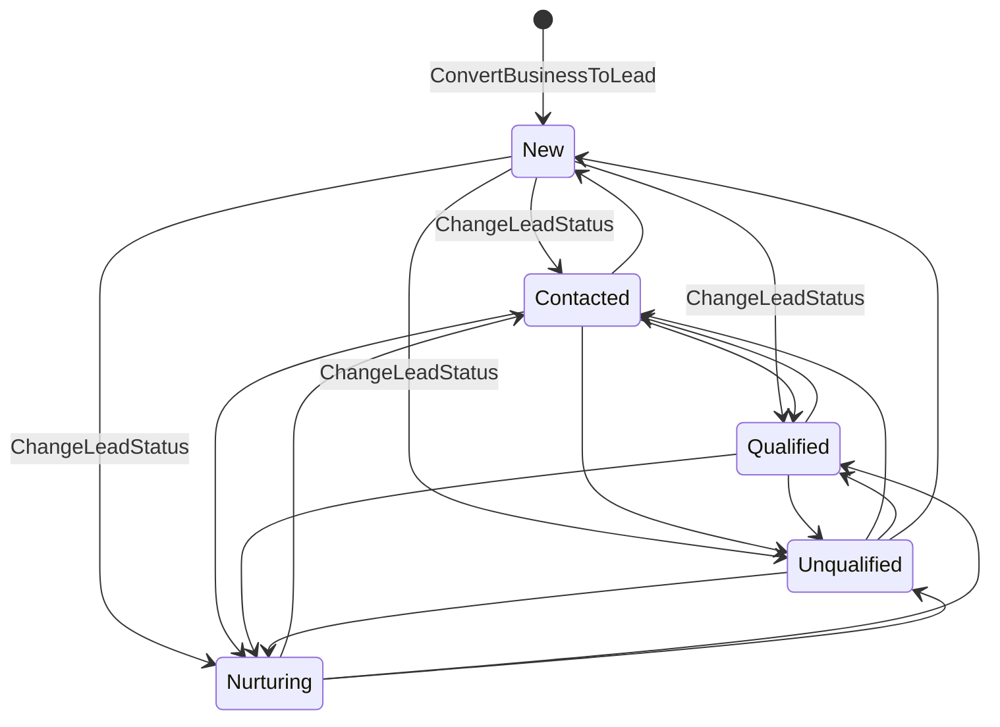
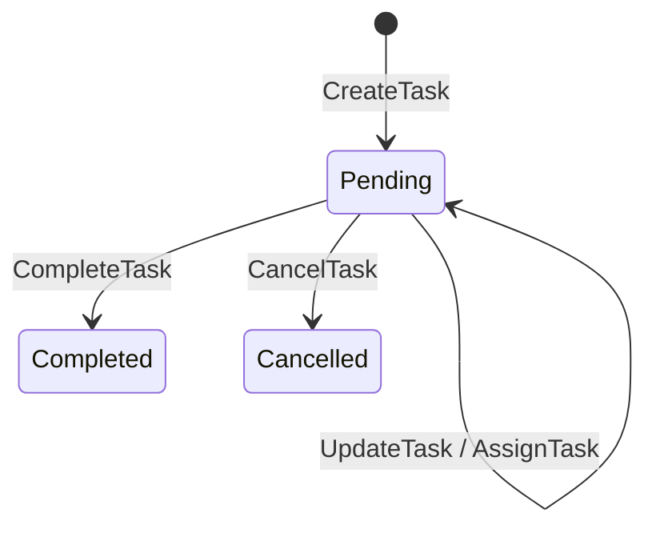
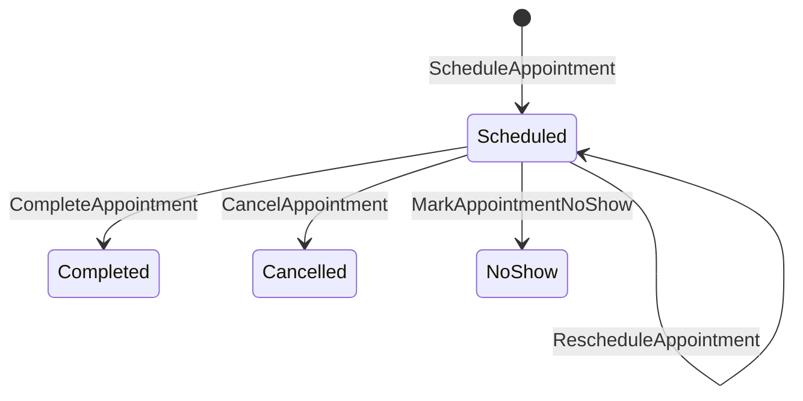

# B2 — CRM State Machines

> **B2 status:** Target design only. For every (state, command) pair there is exactly one outcome. B0 defines **no** Lead, Task, Appointment, Contact, or Note state machine; all five are B2 contributions.

| Aggregate | States | Count | Terminal |
|---|---|---|---|
| Lead | `new`, `contacted`, `qualified`, `unqualified`, `nurturing` | **5** | none (archive is an orthogonal flag) |
| Task | `pending`, `completed`, `cancelled` | **3** | `completed`, `cancelled` |
| Appointment | `scheduled`, `completed`, `cancelled`, `no_show` | **4** | `completed`, `cancelled`, `no_show` |
| Contact | `active`, `archived` | 2 | `archived` |
| Note | `active`, `archived` | 2 | `archived` |

No state name is reused across aggregates with a different meaning. `cancelled` means the same thing for a Task and an Appointment (abandoned before completion); `archived` means the same thing for a Contact and a Note (soft-removed, retained).

## 1. Lead

Every one of the five states is `RUNTIME_CANONICAL` (`data.js:500` `leadStatusLabels`). No sixth state is invented.

### 1.1 State meanings

| State | Meaning | Entry | Exit |
|---|---|---|---|
| `new` | converted, no human has worked it yet | the only creation state | any other state |
| `contacted` | someone has reached out | a human sets it | any other state |
| `qualified` | judged worth pursuing | a human sets it | any other state |
| `unqualified` | judged not worth pursuing **now** | a human sets it | any other state — **non-terminal by design** |
| `nurturing` | not now, revisit later | a human sets it | any other state |

**The graph is deliberately complete, not linear.** Any state may move to any other. Justification, and it matters: the frozen UI is an unconstrained `<select>` over all five labels (`Lead360.tsx` `lead-quick-controls`), and `updateLeadStatus` validates only membership in the label map — it enforces no ordering whatsoever. Imposing a funnel (`new → contacted → qualified`) would be a **new product rule invented by the backend**, and it would break the everyday correction of a mis-clicked status. The only forbidden transition is a self-transition.

**`unqualified` is not terminal.** A business that was not ready in March is a legitimate lead in September. The frozen tree has no reopen concept because it never made `unqualified` a dead end.

### 1.2 Transitions

| From | Command | Permission | Guard | To | Event | Audit | Failure |
|---|---|---|---|---|---|---|---|
| — | `ConvertBusinessToLead` | `business.convert` | `B2_LEAD_PROVENANCE_DUPLICATION.md` §5 steps 1–8 | `new` | `LeadCreated` | `lead.converted` | `404` / `409 CONFLICT` / `403 QUOTA_EXHAUSTED` |
| any | `ChangeLeadStatus` | `lead.update` | `If-Match`; target ∈ the 5 values; `to <> from`; Lead not archived | target | `LeadStatusChanged` | `lead.status_changed` (before/after) | `409 STALE_VERSION` / `400 VALIDATION_ERROR` / `409 CONFLICT` (`invalid_lead_transition`, `lead_archived`) |
| any | `ChangeLeadPriority` | `lead.update` | `If-Match`; target ∈ the 3 values; `to <> from`; not archived | unchanged | `LeadPriorityChanged` | `lead.priority_changed` | as above |
| any | `AssignLeadOwner` | `lead.assign` | `If-Match`; target Membership `active` in this workspace; `to <> from`; not archived | unchanged | `LeadOwnerChanged` | `lead.owner_changed` | `409 CONFLICT` (`owner_membership_inactive`) / `404` |
| any | `AddLeadTag` / `RemoveLeadTag` | `lead.update` | `If-Match`; tag 1–40 chars; not archived | unchanged | `LeadTagAdded` / `LeadTagRemoved` | `lead.tag_added` / `lead.tag_removed` | `409 STALE_VERSION` |
| any | `ArchiveLead` | `lead.archive` | `If-Match`; not already archived | unchanged (`archived_at` set) | `LeadArchived` | `lead.archived` | `409 CONFLICT` (`lead_archived`) |
| archived | **any CRM mutation** | — | — | unchanged | — | denial row | `409 CONFLICT` (`lead_archived`) |

A no-op transition (`to == from`) is `400 VALIDATION_ERROR`, not a silent `200`. A silent success would emit an event and bump a version for a change that did not happen, corrupting the timeline and every `If-Match` a concurrent client holds.

### 1.3 Archive is orthogonal to status

`archived_at` is a flag, not a sixth state. An archived Lead retains its status, so "we archived 40 leads that were `qualified`" stays answerable. Deal and Conversation interactions: archiving a Lead **never** closes a Deal or a Conversation (§`B2_DOMAIN_OWNERSHIP.md` §3.4), and creating a Deal or Conversation against an archived Lead is the owning domain's decision, not CRM's.

## 2. Task

| From | Command | Permission | Guard | To | Event | Failure |
|---|---|---|---|---|---|---|
| — | `CreateTask` | `task.manage` | Lead not archived; `due_at` present; assignee active | `pending` | `TaskCreated` | `409 CONFLICT` (`lead_archived`) / `400` |
| `pending` | `UpdateTask` | `task.manage` | `If-Match`; allow-listed fields only | `pending` | `TaskUpdated` | `409 STALE_VERSION` |
| `pending` | `AssignTask` | `task.manage` | `If-Match`; assignee active in this workspace | `pending` | `TaskAssigned` | `409 CONFLICT` (`assignee_membership_inactive`) |
| `pending` | `CompleteTask` | `task.manage` | `If-Match` | `completed` | `TaskCompleted` | `409 STALE_VERSION` |
| `pending` | `CancelTask` | `task.manage` | `If-Match` | `cancelled` | `TaskCancelled` | `409 STALE_VERSION` |
| `completed` \| `cancelled` | any | — | terminal | unchanged | — | `409 CONFLICT` (`task_already_terminal`) |

**Reopen is not modelled** (`B2-D-C009`). `overdue` is **not a state** — it is `status = 'pending' AND due_at < now()` (`B2_TASK_APPOINTMENT_MODEL.md` §2). Any document or implementation that stores `overdue` contradicts this package.

## 3. Appointment

| From | Command | Permission | Guard | To | Event | Failure |
|---|---|---|---|---|---|---|
| — | `ScheduleAppointment` | `appointment.manage` | Lead not archived; `end_at > start_at`; organizer active; known `type`/`location_type`; `deal_public_id` belongs to this Lead | `scheduled` | `AppointmentCreated` | `400 VALIDATION_ERROR` / `409 CONFLICT` |
| `scheduled` | `RescheduleAppointment` | `appointment.manage` | `If-Match`; `end_at > start_at` | `scheduled` | `AppointmentRescheduled` | `409 STALE_VERSION` |
| `scheduled` | `CancelAppointment` | `appointment.manage` | `If-Match` | `cancelled` | `AppointmentCancelled` | `409 STALE_VERSION` |
| `scheduled` | `CompleteAppointment` | `appointment.manage` | `If-Match` | `completed` | `AppointmentCompleted` | `409 STALE_VERSION` |
| `scheduled` | `MarkAppointmentNoShow` | `appointment.manage` | `If-Match` | `no_show` | `AppointmentNoShowRecorded` | `409 STALE_VERSION` |
| terminal | any | — | terminal | unchanged | — | `409 CONFLICT` (`appointment_already_terminal`) |

**An owner overlap never blocks a transition.** It sets `overlap_warning` on the response (`B2_TASK_APPOINTMENT_MODEL.md` §6).

## 4. Contact and Note

| Aggregate | From | Command | To | Event |
|---|---|---|---|---|
| Contact | — | `AddContact` | `active` | `ContactAdded` |
| Contact | `active` | `UpdateContact` | `active` | `ContactUpdated` |
| Contact | `active` | `RemoveContact` | link `unlinked`; the Contact row stays `active` | `ContactRemoved` |
| Note | — | `AddNote` | `active` | `NoteAdded` |
| Note | `active` | `RemoveNote` | `archived` | `NoteRemoved` |

`RemoveContact` unlinks; it does not archive the Contact, because a Contact may serve other Leads (`B2_CONTACT_MODEL.md` §6). `UpdateNote` is `NOT_SUPPORTED` (`B2-D-C012`).

## 5. Command → state-machine mapping

Of the **22** commands in `B2_COMMAND_EVENT_CATALOG.md`, **all 22** appear as a labelled transition in at least one machine above.

`UNMAPPED_STATE_COMMANDS = 0`. There is no CRM analogue of B1's stateless `RequestPasswordReset`: every CRM command changes durable aggregate state.

## 6. Cross-aggregate transition effects

Every Task and Appointment transition, every Note and Contact command, and every Lead field change additionally, **in the same transaction**:
1. appends a `crm_activities` row, whose `type` comes from the closed **21-type** canonical vocabulary in `B2_CRM_ACTIVITY_VOCABULARY.md` §2 — **except** for `UpdateTask` and `AssignTask`, which write **NO TIMELINE ACTIVITY ROW** (`B2_CRM_ACTIVITY_VOCABULARY.md` §6) while still performing steps 2–5;
2. applies `leads.last_activity_at = GREATEST(last_activity_at, occurred_at)`, except `ArchiveLead`;
3. recomputes `leads.next_activity_at` when the command touched a Task;
4. bumps the mutated aggregate's `version` by exactly 1;
5. writes the `audit_logs` row and the outbox event(s).

The Lead's `version` is bumped **only** by commands that mutate the Lead row itself. Creating a Task does not bump the Lead's version, so a user editing a Lead's status does not lose their `If-Match` because a colleague added a task — but it does update `last_activity_at`, which is a maintained column excluded from the optimistic-concurrency check. This distinction is stated because getting it wrong makes `If-Match` fire constantly under normal team use.
